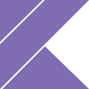

### Hi, i'm Zé! 👋

I am actually a computer science student at University of São Paulo (USP). I really like to learn and do some programming stuffs. Also, I think that technology can improve our world.

- 🤖 Actually, i'm studying some topics of artificial intelligence and robotics
- 🌐 I'm very interested in open source web systems.
- 🧪 I'm a member of [USPCodeLab](https://codelab.ime.usp.br/), an academic group that works on technologies improvements at University of São Paulo.
- 💻 I'm a member of [BCC support group](https://bcc.ime.usp.br/principal/miscelanea/rc.html), a course group that aims to improve computer science degree at USP.

**Here are some technologies and languages i've worked with:**

  
  
  
  
  
  
  
  
  
  

**And here are some technologies and languages that i'm learning and improving:**

  
  
  
  
  
  

